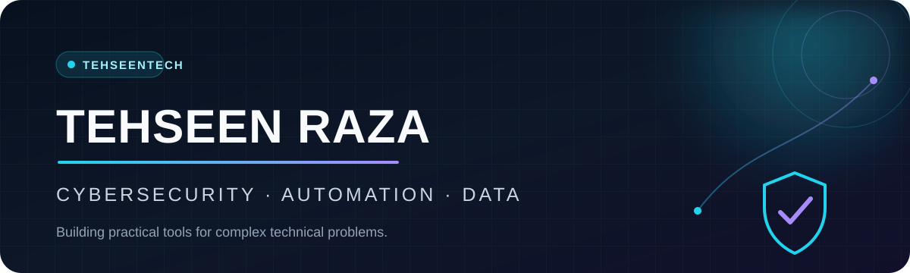

<p align="center">
  
</p>

<p align="center">
  <a href="https://github.com/TehseenTech?tab=repositories">
    
  </a>
  <a href="https://github.com/TehseenTech?tab=followers">
    
  </a>
  <a href="https://www.linkedin.com/in/tehseenrazahacker/">
    
  </a>
</p>

## About me

I’m **Tehseen Raza**, a builder exploring the intersection of **cybersecurity, automation, data, and AI-assisted developer workflows**. I turn complex technical problems into practical tools—from telecom dashboards and API-powered utilities to deployment workflows, self-hosted systems, and reusable AI agent skills.

> **My approach:** build responsibly, keep the experience simple, and make the result genuinely useful.

### Current focus

- Responsible and authorized security research
- OSINT and privacy-aware data tooling
- Dashboards for complex datasets
- Automation, deployment, and self-hosting
- AI agent workflows and reusable Manus skills

## Featured project

### [Tehseen Tech Manus Skills](https://github.com/TehseenTech/manus-skills)

A public collection of **78 reusable Manus AI agent skills** for research, software development, workflow automation, data, content, design, integrations, and repeatable operations. Each skill includes request-oriented metadata, documented workflows, resources, and automatic-discovery guidance.

[Explore the repository](https://github.com/TehseenTech/manus-skills) · [Read the quickstart](https://github.com/TehseenTech/manus-skills/blob/main/docs/quickstart.md) · [Browse the skill finder](https://github.com/TehseenTech/manus-skills/blob/main/docs/skill-finder.md)

## Toolbox

<p align="center">
  
  
  
  
  
  
  
  
  
  
</p>

## Featured work

<table>
  <tr>
    <td width="50%" valign="top">
      <h3><a href="https://github.com/TehseenTech/Cdr-dashboard-by-Tehseen-raza">CDR Dashboard</a></h3>
      <p>A dashboard-focused workspace for exploring and presenting telecom call-detail data.</p>
      <p><code>Python</code> <code>Streamlit</code> <code>Data</code></p>
    </td>
    <td width="50%" valign="top">
      <h3><a href="https://github.com/TehseenTech/iPhone-proxy-system">iPhone Proxy System</a></h3>
      <p>Country-aware proxy configuration with scheduled updates and GitHub Pages deployment.</p>
      <p><code>Node.js</code> <code>Automation</code> <code>GitHub Actions</code></p>
    </td>
  </tr>
  <tr>
    <td width="50%" valign="top">
      <h3><a href="https://github.com/TehseenTech/GitHub-Wrapped">GitHub Wrapped</a></h3>
      <p>Python experiments that turn GitHub API activity into a readable developer snapshot.</p>
      <p><code>Python</code> <code>GitHub API</code> <code>CLI</code></p>
    </td>
    <td width="50%" valign="top">
      <h3><a href="https://github.com/TehseenTech/Tehseenraza.github.io">Personal Portfolio Repository</a></h3>
      <p>The source repository for a portfolio focused on cybersecurity, data work, and professional project highlights.</p>
      <p><code>HTML</code> <code>CSS</code> <code>SEO</code></p>
    </td>
  </tr>
</table>

## How I like to build

```text
Understand the real problem
        ↓
Design the simplest useful solution
        ↓
Automate the repetitive parts
        ↓
Document it so others can use it
```

## Let’s connect

<p>
  <a href="https://github.com/TehseenTech">
    
  </a>
  <a href="https://www.linkedin.com/in/tehseenrazahacker/">
    
  </a>
  <a href="https://github.com/TehseenTech?tab=repositories">
    
  </a>
</p>

---

<p align="center">
  <sub>Building useful technology, one practical experiment at a time.</sub>
</p>
